# Breast-Cancer-Detection-CNN-FastAPI-AWS-Django

python -m venv myvenv

# MACOS

python3 -m venv myvenv

source myvenv/bin/activate

pip3 install "fastapi[standard]"

pip3 install -r requirements.txt

npm --version

npm install -g serverless

npm install --save-dev serverless-python-requirements

# WINDOWS

python -m venv myvenv

myvenv\Scripts\activate.bat

pip install "fastapi[standard]"

pip install -r requirements.txt

npm --version

npm install -g serverless

npm install --save-dev serverless-python-requirements

# Setup file .env 

python setup_aws.py

serverless login

# Add permission for IAM Role User

Find IAM Role Click on user and click on permissions tab.
Click on Attach Policy button.

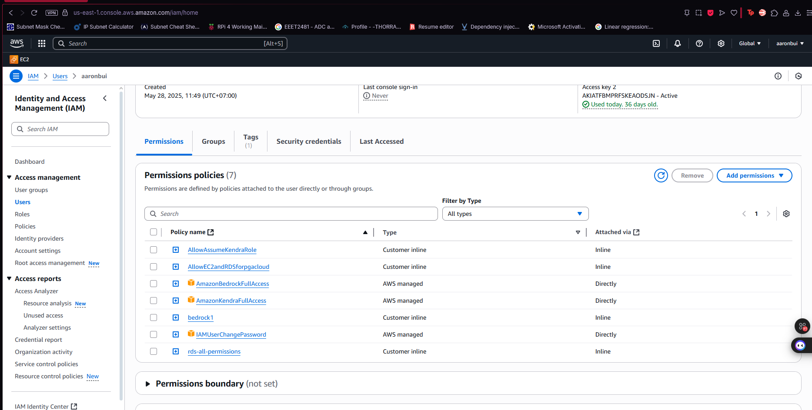

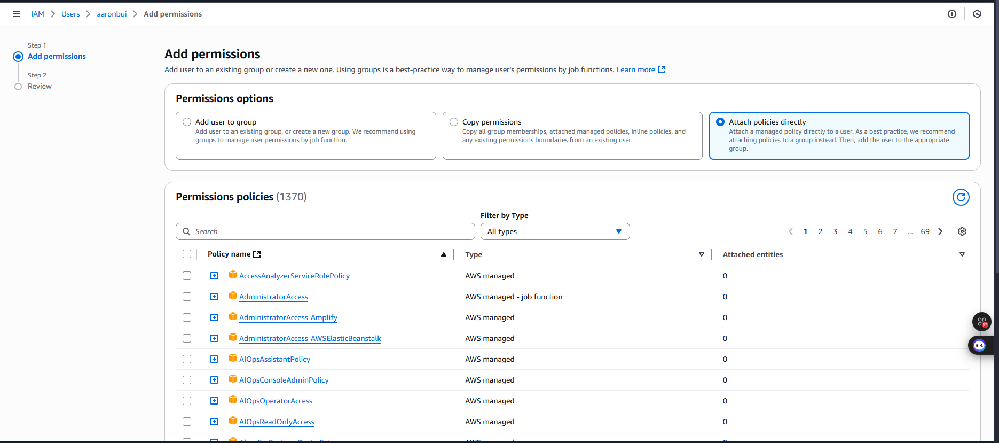

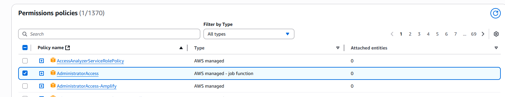

Then click add

# For deployment read file DEPLOYMENT.md

or run command: 

python create_torch_layer.py

Go to AWS console -> Layers -> Create layer

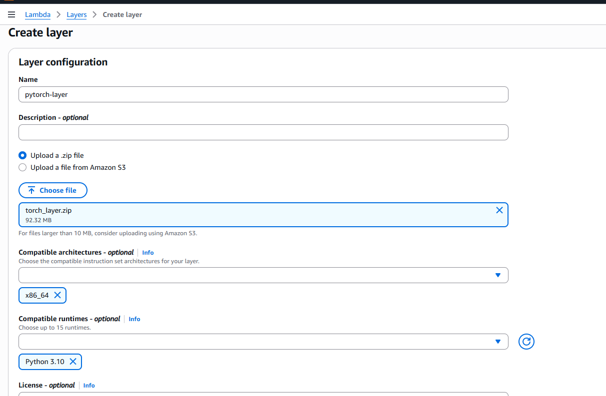

serverless deploy --stage prod --verbose

# Successful deployment

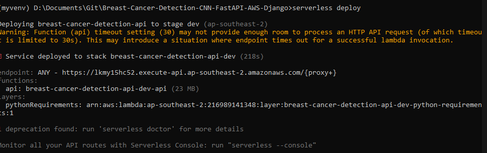

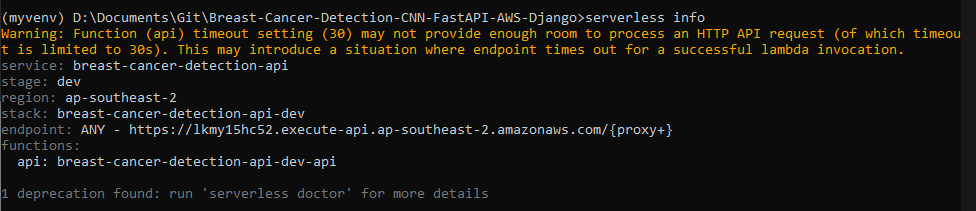

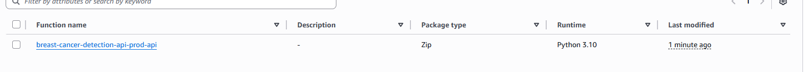

# If you run serverless deploy and it's bugged then install Docker: https://docs.docker.com/desktop/setup/install/windows-install/

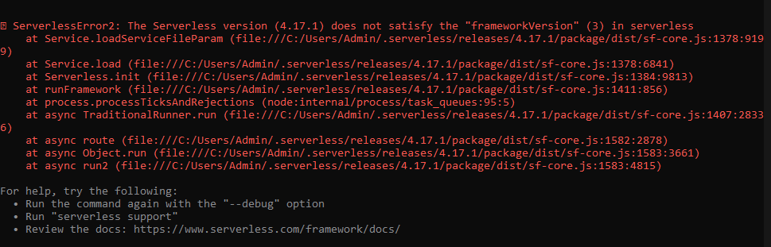

# If it's due to serverless version
npm uninstall -g serverless
npm install -g serverless@3.38.0

# If you run serverless deploy and it's due to docker then run command:

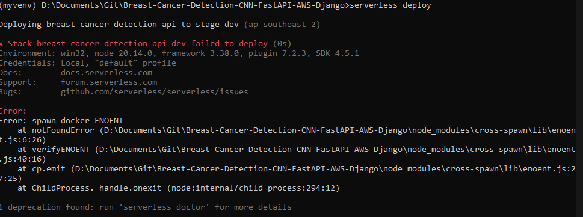

# If you run serverless deploy and it's due to large file then run command:

python largefile.py

Then find the file more than 2Gb and put it in package pattern in serverless.yml

# If serverless deploy successful but you type in url and it says Internal Server Error then run command:

serverless logs -f api

Version Docker 4.43.1

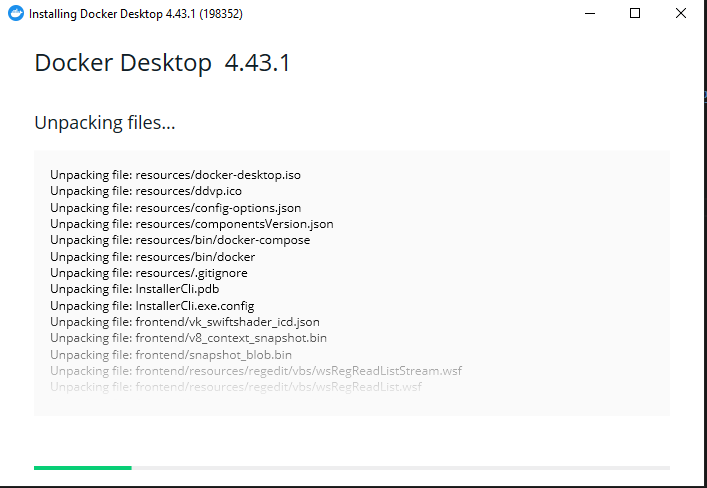

# Login using either Github or Google

# Create name

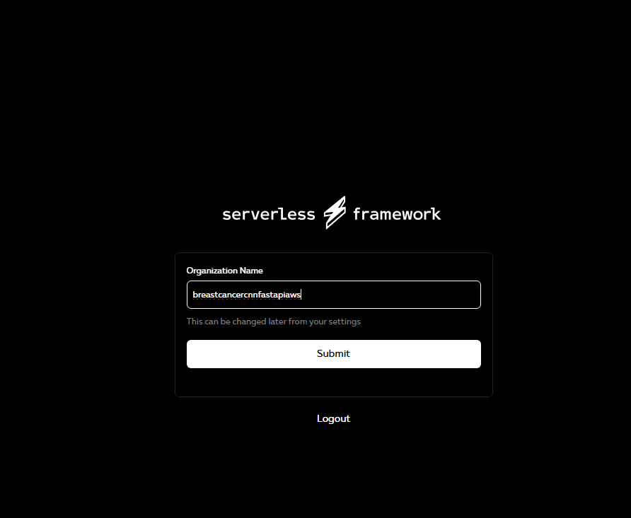

#!/bin/bash
uvicorn app.main:app --reload

curl -X POST "http://127.0.0.1:8000/predict/" -H "accept: application/json" -H "Content-Type: multipart/form-data"  -F "file=@image_class1.png"

# Curl result on WINDOWS

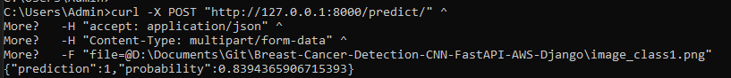

# View downloading libraries on docker

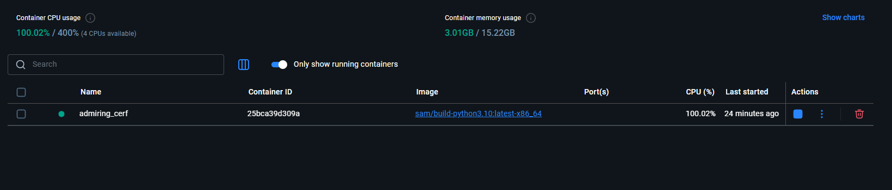

Click on view details

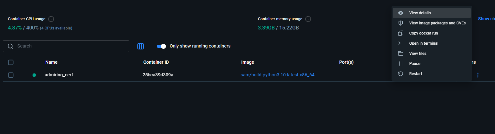

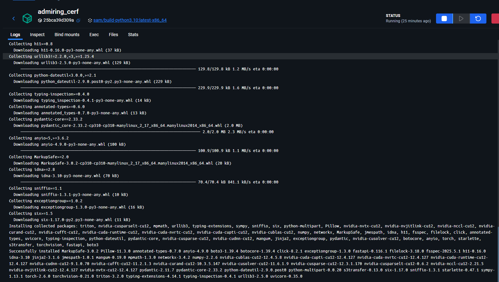

# Retrieve API key using AWS CLI

aws apigateway get-api-keys --name-query "breast-cancer-api-key-dev" --include-values

# Curl to use with API key

curl -H "x-api-key: YOUR_API_KEY" https://your-api-endpoint.execute-api.ap-southeast-2.amazonaws.com/dev/health
